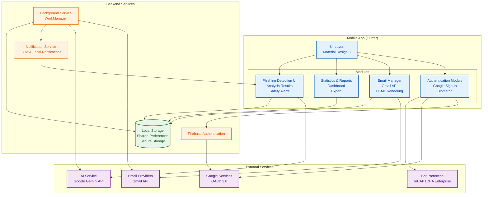

# Sơ đồ Kiến trúc Hệ thống GuardMail

```mermaid
graph TD
    %% Styling
    classDef mobile fill:#e3f2fd,stroke:#1565c0,stroke-width:2px,color:#0d47a1;
    classDef backend fill:#fff3e0,stroke:#ef6c00,stroke-width:2px,color:#e65100;
    classDef external fill:#f3e5f5,stroke:#7b1fa2,stroke-width:2px,color:#4a148c;
    classDef database fill:#e8f5e9,stroke:#2e7d32,stroke-width:2px,color:#1b5e20;

    subgraph MobileApp ["Mobile App (Flutter)"]
        direction TB
        UI["UI Layer<br/>Material Design 3"]:::mobile
        
        subgraph Modules
            AuthMod["Authentication Module<br/>Google Sign-In<br/>Biometric"]:::mobile
            EmailMod["Email Manager<br/>Gmail API<br/>HTML Rendering"]:::mobile
            StatsMod["Statistics & Reports<br/>Dashboard<br/>Export"]:::mobile
            DetectMod["Phishing Detection UI<br/>Analysis Results<br/>Safety Alerts"]:::mobile
        end
        
        UI --> AuthMod
        UI --> EmailMod
        UI --> StatsMod
        UI --> DetectMod
    end

    subgraph BackendServices ["Backend Services"]
        direction TB
        FirebaseAuth["Firebase Authentication"]:::backend
        NotifService["Notification Service<br/>FCM & Local Notifications"]:::backend
        BgService["Background Service<br/>WorkManager"]:::backend
        
        LocalStorage[("Local Storage<br/>Shared Preferences<br/>Secure Storage")]:::database
    end

    subgraph ExternalServices ["External Services"]
        direction TB
        GoogleOAuth["Google Services<br/>OAuth 2.0"]:::external
        GmailProvider["Email Providers<br/>Gmail API"]:::external
        GeminiAI["AI Service<br/>Google Gemini API"]:::external
        Recaptcha["Bot Protection<br/>reCAPTCHA Enterprise"]:::external
    end

    %% Connections
    AuthMod --> FirebaseAuth
    AuthMod --> GoogleOAuth
    FirebaseAuth --> GoogleOAuth
    
    EmailMod --> GmailProvider
    EmailMod --> LocalStorage
    
    DetectMod --> GeminiAI
    DetectMod --> LocalStorage
    
    BgService --> GmailProvider
    BgService --> GeminiAI
    BgService --> NotifService
    NotifService --> DetectMod
    
    StatsMod --> LocalStorage
    BgService --> LocalStorage
    
    AuthMod --> Recaptcha
```
