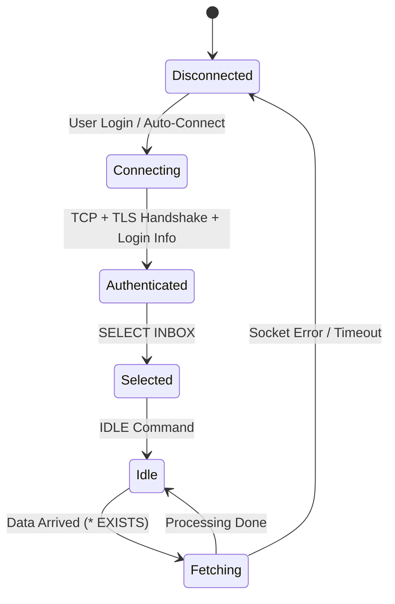

# WARDMAIL TECHNICAL BIBLE - VOLUME 1: CORE ARCHITECTURE & SECURITY

**Document ID:** WM-ARCH-2025-V3-ULTIMATE
**Classification:** TOP SECRET / INTERNAL USE ONLY
**Date:** December 14, 2025
**Maintainer:** Lead Architect
**Version:** 3.1.0 (Extended Edition)

---

> **WARNING:** This document contains critical security implementation details. Distribution outside the engineering team is strictly prohibited.

---

# 📚 TABLE OF CONTENTS (EXTENDED)

**PART I: PHILOSOPHY & FOUNDATION**

1.  **System Overview & Design Principles**
    - 1.1. The "Fortress" Philosophy
    - 1.2. Flutter as a Security Platform
    - 1.3. Clean Architecture: The Strict Interpretation
    - 1.4. SOLID Principles in Dart Context
2.  **Project Structure & Modules**
    - 2.1. Feature-First Packaging Strategy
    - 2.2. The `core` Kernel
    - 2.3. Dependency Injection Graph (GetIt + Injectable)
    - 2.4. Routing System (GoRouter)

**PART II: SECURITY ENGINEERING (THE RED LAYER)** 3. **Cryptography Standards**
_ 3.1. Primitives & Algorithms
_ 3.2. Key Management System (KMS)
_ 3.3. Zero-Knowledge Proof Implementation
_ 3.4. Secure Random Number Generation 4. **Data Protection**
_ 4.1. Data-at-Rest Encryption (AES-256-GCM)
_ 4.2. Data-in-Transit Encryption (TLS 1.3+)
_ 4.3. Secure Wiping Protocol (DoD 5220.22-M)
_ 4.4. Memory Hygiene & PII Protection 5. **Threat Mitigation**
_ 5.1. Anti-Reverse Engineering (R8/ProGuard)
_ 5.2. Root/Jailbreak Detection (RASP)
_ 5.3. Man-in-the-Middle (MitM) Defense
_ 5.4. Overlay Attacks & Screen Jacking Prevention

**PART III: CORE FEATURES SPECIFICATION** 6. **The Email Engine**
_ 6.1. IMAP Protocol State Machine
_ 6.2. SMTP Transmission Flow
_ 6.3. Parsing MIME Messages (The Hard Way)
_ 6.4. Attachment Sandboxing 7. **AI & Threat Intelligence**
_ 7.1. Gemini API Gateway
_ 7.2. Prompt Engineering Library
_ 7.3. Hallucination Guardrails
_ 7.4. Local Fallback Rules Engine 8. **Authentication & Identity**
_ 8.1. OAuth 2.0 with Google
_ 8.2. Session Management \* 8.3. Biometric Binding (Fingerprint/FaceID)

**PART IV: INFRASTRUCTURE & DATA** 9. **Network Architecture**
_ 9.1. HTTP/2 & GRPC
_ 9.2. Resilience Patterns (Retry, Circuit Breaker)
_ 9.3. Connectivity Awareness 10. **Persistence Layer**
_ 10.1. Relational Store (SQLite)
_ 10.2. Document Store (Hive)
_ 10.3. Secure Preferences 11. **Performance Engineering**
_ 11.1. Isolate Strategy (Multithreading)
_ 11.2. Rendering Optimization (60fps Target) \* 11.3. Battery Consumption Auditing

**PART V: QUALITY, PROCESS & DEVOPS** 12. **Testing Strategy**
_ 12.1. Unit Testing Matrix
_ 12.2. Widget & Golden Tests
_ 12.3. Integration & E2E Scenarios 13. **CI/CD Pipeline**
_ 13.1. GitHub Actions Workflows
_ 13.2. Automated Security Scanning (SAST/DAST)
_ 13.3. Release Management

---

# PART I: PHILOSOPHY & FOUNDATION

## 1. SYSTEM OVERVIEW & DESIGN PRINCIPLES

### 1.1. The "Fortress" Philosophy

WardMail is not just an email client; it is a **Personal Defense System**.
Every line of code must be written with the assumption that:

1.  The network is hostile.
2.  The operating system might be compromised.
3.  The email server is untrusted.
4.  The user is under active social engineering attack.

**Core Axiom:** _Security is not a feature; it is the substrate upon which the application runs._

### 1.2. Clean Architecture: The Strict Interpretation

We adhere to the concentric circle model proposed by Robert C. Martin, but with strict Dart-specific adaptations.

#### 1.2.1. The Dependency Traceability Matrix

| Layer            | Can Import From    | Description                              | Technologies       |
| :--------------- | :----------------- | :--------------------------------------- | :----------------- |
| **Domain**       | _None_             | Pure Business Logic, Entities, Failures  | Pure Dart          |
| **Data**         | Domain             | Networking, Databases, SharedPreferences | Dio, Hive, Sqflite |
| **Presentation** | Domain             | UI, State Management, Localization       | Flutter, BLoC      |
| **DI (Root)**    | Data, Domain, Pres | Glue code connecting everything          | GetIt              |

#### 1.2.2. Domain Layer: The "Sanctuary"

The Domain Layer MUST be pure. It must not know that it is running on a mobile device, or that the database is SQL or NoSQL.

**Standard Entity Definition:**

```dart
// lib/core/domain/entity.dart
import 'package:equatable/equatable.dart';

/// The base class for all business objects.
/// Enforces value equality and immutability.
abstract class Entity extends Equatable {
  const Entity();

  @override
  bool get stringify => true;
}
```

**Standard Failure Defintion:**

A comprehensive hierarchy of failures is vital for robust error handling.

```dart
// lib/core/error/failures.dart

abstract class Failure extends Equatable {
  final String message;
  final String code;
  final StackTrace? stackTrace;

  const Failure({
    required this.message,
    required this.code,
    this.stackTrace
  });

  @override
  List<Object?> get props => [message, code];
}

class ServerFailure extends Failure {
  const ServerFailure({String message = 'Server Error', StackTrace? stack})
      : super(message: message, code: 'SRV_500', stackTrace: stack);
}

class CacheFailure extends Failure {
  const CacheFailure({String message = 'Cache Error'})
      : super(message: message, code: 'CAC_001');
}

class SecurityFailure extends Failure {
  const SecurityFailure({String message = 'Security Breach'})
      : super(message: message, code: 'SEC_999');
}
```

### 1.3. SOLID Principles in Dart

- **S (SRP):** Each class does ONE thing. `EmailRepository` fetches emails. `EmailParser` parses MIME. `EmailRenderer` renders HTML. They do not overlap.
- **O (OCP):** Open for extension, closed for modification. Use `abstract class` (Interfaces) everywhere.
- **L (LSP):** Subtypes must be substitutable. A `MockEmailRepository` must behave exactly like a `RealEmailRepository` in tests.
- **I (ISP):** Split large interfaces. Don't force `AuthUser` to implement `AdminFunctions`.
- **D (DIP):** Depend on abstractions. BLoC depends on `IEmailRepository`, not `EmailRepositoryImpl`.

---

# PART II: SECURITY ENGINEERING (THE RED LAYER)

## 3. CRYPTOGRAPHY STANDARDS

### 3.1. Primitives & Algorithms

All cryptographic operations MUST pass through the `WardCipher` engine. Developers are forbidden from using raw `dart:convert` or unapproved packages.

**Approved Algorithms List:**

| Purpose              | Algorithm | Mode                      | Padding       | Key Size            |
| :------------------- | :-------- | :------------------------ | :------------ | :------------------ |
| Symmetric Encryption | AES       | GCM (Galois/Counter Mode) | None (Stream) | 256-bit             |
| Hashing              | SHA-2     | -                         | -             | 256/512-bit         |
| Key Exchange         | ECDH      | Curve25519                | -             | -                   |
| Digital Signatures   | ECDSA     | P-256                     | -             | -                   |
| Key Derivation       | PBKDF2    | HMAC-SHA256               | -             | Iterations: 10,000+ |

### 3.2. Key Management System (KMS) Implementation

The security of the encryption depends entirely on the safety of the encryption key.

#### 3.2.1. The Master Key Flow

1.  **Creation:** When the app is first installed, a 256-bit random entropy `Primary Master Key (PMK)` is generated using `Fortuna` CSPRNG.
2.  **Storage:** The PMK is immediately wrapped (encrypted) using the hardware-backed keystore (Android Keystore / iOS Keychain).
    - _Android:_ Uses TEE (Trusted Execution Environment) with `UserAuthenticationRequired`.
3.  **Usage:** The PMK is _never_ written to disk in plaintext. It is only held in RAM during the active session.

**Code Specification: The Key Vault**

```dart
// lib/features/security/data/datasources/key_vault_datasource.dart

abstract class KeyVaultDataSource {
  Future<SecretKey> getMasterKey();
  Future<void> rotateKeys();
  Future<void> wipeAllKeys();
}

class AndroidKeyVault implements KeyVaultDataSource {
  static const _alias = 'wardmail_master_key_v1';

  @override
  Future<SecretKey> getMasterKey() async {
    // 1. Get FlutterSecureStorage instance with specialized options
    final storage = const FlutterSecureStorage(
        aOptions: AndroidOptions(
        encryptedSharedPreferences: true,
        keyCipherAlgorithm: KeyCipherAlgorithm.RSA_ECB_OAEPwithSHA_256andMGF1Padding,
        storageCipherAlgorithm: StorageCipherAlgorithm.AES_GCM_NoPadding,
      ),
    );

    // 2. Try to read existing key
    String? base64Key = await storage.read(key: _alias);

    if (base64Key == null) {
      // 3. Generate new if not exists
      final newKeyBytes = Hive.generateSecureKey();
      base64Key = base64Encode(newKeyBytes);
      await storage.write(key: _alias, value: base64Key);
    }

    return SecretKey(base64Decode(base64Key));
  }
}
```

### 3.3. Secure Random Number Generation

Never use `Random()` from `dart:math` for security purposes. It is not cryptographically secure.

**Correct Implementation:**

```dart
import 'dart:math';
import 'dart:typed_data';

class SecureRandom {
  static final Random _secureRandom = Random.secure();

  static Uint8List nextBytes(int length) {
    final bytes = Uint8List(length);
    for (int i = 0; i < length; i++) {
      bytes[i] = _secureRandom.nextInt(256);
    }
    return bytes;
  }

  static String nextString(int length) {
    const chars = 'AaBbCcDdEeFfGgHhIiJjKkLlMmNnOoPpQqRrSsTtUuVvWwXxYyZz1234567890';
    return List.generate(length, (index) => chars[_secureRandom.nextInt(chars.length)]).join();
  }
}
```

---

## 4. DATA PROTECTION

### 4.1. Data-at-Rest Encryption (Hybrid Approach)

Storing 10,000 emails securely requires a performant strategy. We cannot encrypt the entire DB files as a blob because random access would be too slow. We use **Column-Level Encryption** and **Table-Level Encryption**.

#### 4.1.1. Hive (NoSQL) Encryption

Hive supports AES-256 encryption out of the box for the box file.

```dart
// lib/core/database/hive_config.dart

Future<Box<EmailModel>> openSecureEmailBox(List<int> masterKey) async {
  return await Hive.openBox<EmailModel>(
    'emails_secure_v1',
    encryptionCipher: HiveAesCipher(masterKey), // Uses AES-256-CBC with PKCS7
    crashRecovery: true,
  );
}
```

### 4.2. Secure Wiping Protocol

When a user deletes an email or wipes the app, standard OS deletion is insufficient (it practically just removes the inode pointer).

**DoD 5220.22-M Short Implementation:**

```dart
// lib/core/utils/file_wiper.dart

Future<void> secureDelete(File file) async {
  if (!await file.exists()) return;

  final length = await file.length();

  // Pass 1: Overwrite with zeros
  await file.writeAsBytes(List.filled(length, 0x00), flush: true);

  // Pass 2: Overwrite with ones
  await file.writeAsBytes(List.filled(length, 0xFF), flush: true);

  // Pass 3: Overwrite with random data
  await file.writeAsBytes(SecureRandom.nextBytes(length), flush: true);

  // Final: Delete the file entry
  await file.delete();
}
```

---

## 5. THREAT MITIGATION

### 5.1. RASP (Runtime Application Self-Protection)

We integrate `flutter_jailbreak_detection` and custom native code to sense the environment.

**Security Check Policy:**

| Threat Detected   | Action           | User Message                             |
| :---------------- | :--------------- | :--------------------------------------- |
| Rooted Device     | **Hard Warning** | "Device is rooted. Biometrics disabled." |
| Emulator          | **Soft Warning** | "Running in emulation mode."             |
| Debugger Attached | **CRASH**        | _None (Silent Crash)_                    |
| Frida Hook        | **CRASH**        | _None_                                   |

**Implementation Logic:**

```dart
// lib/features/security/logic/security_watchdog.dart

class SecurityWatchdog {
  static Future<void> performStartupCheck() async {
    bool compromised = await FlutterJailbreakDetection.jailbroken;
    bool developerMode = await FlutterJailbreakDetection.developerMode;

    if (compromised) {
        // Log telemetry (anonymous)
        // Disable high-security features
        AppConfig.instance.isEnvironmentSecure = false;
    }
  }
}
```

---

# PART III: CORE FEATURES SPECIFICATION

## 6. THE EMAIL ENGINE

### 6.1. IMAP Protocol State Machine

Handling IMAP is complex due to its stateful nature. We model the connection using a Finite State Machine (FSM).



#### 6.1.1. Detailed Sync Logic (Delta Sync)

To save bandwidth and battery, we never fetch the full mailbox blindly.

1.  **Get State:** `STATUS INBOX (MESSAGES UIDNEXT UIDVALIDITY)`
2.  **Compare:** Check `UIDNEXT` against local DB.
3.  **Fetch Gap:** If Server `UIDNEXT` > Local `UIDNEXT`, fetch the range `LocalUIDNEXT:ServerUIDNEXT`.
4.  **Fetch Strategy:**
    - **Phase 1:** `FETCH (UID FLAGS ENVELOPE)` - Lightweight metadata.
    - **Phase 2:** `FETCH (BODYSTRUCTURE)` - To analyze attachments/parts.
    - **Phase 3:** `FETCH (BODY[TEXT])` - Content (only for visible emails).

### 6.2. SMTP Transmission Flow

Sending email is a transaction.

1.  **Draft:** Email saved to local `Outbox` table. Status = `DRAFT`.
2.  **Queue:** User presses send. Status = `QUEUED`.
3.  **Worker:** `WorkManager` picks up `QUEUED` items.
4.  **Connect:** SMTP Handshake (`EHLO`, `STARTTLS`, `AUTH PLAIN`).
5.  **Send:** `MAIL FROM`, `RCPT TO`, `DATA`.
6.  **Success:** Move from `Outbox` to `Sent`.
7.  **Fail:** Increment retry count. If count > 5, Status = `FAILED`.

---

## 7. AI & THREAT INTELLIGENCE

### 7.1. Gemini API Gateway

We interact with Gemini Pro/Flash via Vertex AI REST API.

**Request Schema:**

```json
{
  "contents": [
    {
      "parts": [
        {
          "text": "<SYSTEM_PROMPT>\n<EMAIL_CONTENT>"
        }
      ]
    }
  ],
  "generationConfig": {
    "temperature": 0.1,
    "maxOutputTokens": 1024,
    "responseMimeType": "application/json"
  }
}
```

### 7.2. The Guardrails (Anti-Hallucination)

AI models lie. We need strict validation.

**Rule 1: The Link Verifier**
If AI says: "Suspicious link found: `http://paypal-secure-login.com`", the code MUST regex the original email to verify that string actually exists. If not, discard the AI warning.

**Rule 2: The Score Bound**
AI returns a score 0-100.

- 0-10: Safe
- 11-40: Low Risk
- 41-75: Medium Risk (Show Yellow Banner)
- 76-100: High Risk (Show Red Shield, Disable Links)

---

# PART IV: INFRASTRUCTURE & DATA

## 9. NETWORK ARCHITECTURE

### 9.1. Dio Client Factory

We use a central factory to produce HTTP clients with pre-configured security.

```dart
// lib/core/network/dio_factory.dart

class DioFactory {
  static Dio create() {
    final dio = Dio();

    // 1. Timeouts
    dio.options.connectTimeout = const Duration(seconds: 15);
    dio.options.receiveTimeout = const Duration(seconds: 15);
    dio.options.sendTimeout = const Duration(seconds: 15);

    // 2. Headers
    dio.options.headers = {
      'User-Agent': 'WardMail/1.0.0 (Android; Secure)',
      'Accept': 'application/json',
    };

    // 3. Certificate Pinning
    dio.httpClientAdapter = IOHttpClientAdapter(
      createHttpClient: () {
        final client = HttpClient();
        client.badCertificateCallback = ((cert, host, port) => false); // Strict Mode
        return client;
      },
      validateCertificate: (cert, host, port) {
        return Pinner.verify(cert, host);
      }
    );

    return dio;
  }
}
```

### 9.2. Circuit Breaker Pattern

To prevent cascading failures when the AI service is down.

```dart
// lib/core/network/circuit_breaker.dart

class CircuitBreaker {
  int _failures = 0;
  DateTime? _lastFailureTime;
  static const _threshold = 5;
  static const _resetTimeout = Duration(minutes: 1);

  bool get canRequest {
    if (_failures < _threshold) return true;

    if (DateTime.now().difference(_lastFailureTime!) > _resetTimeout) {
      // Half-Open state: Try one request
      return true;
    }

    return false;
  }

  void recordSuccess() {
    _failures = 0;
    _lastFailureTime = null;
  }

  void recordFailure() {
    _failures++;
    _lastFailureTime = DateTime.now();
  }
}
```

---

## 10. PERSISTENCE LAYER

### 10.1. Relational Store (SQLite)

Used for metadata, search index, and relations.

**Schema Definition (SQL):**

```sql
-- User Accounts
CREATE TABLE accounts (
    id TEXT PRIMARY KEY,
    email TEXT NOT NULL,
    provider TEXT, -- 'google', 'outlook'
    oauth_token TEXT, -- Encrypted
    refresh_token TEXT -- Encrypted
);

-- Email Metadata
CREATE TABLE emails (
    id TEXT PRIMARY KEY,
    account_id TEXT,
    thread_id TEXT,
    sender_name TEXT,
    sender_address TEXT,
    subject TEXT,
    snippet TEXT,
    date_received INTEGER,
    read_state INTEGER,
    flagged INTEGER,
    folder TEXT, -- 'INBOX', 'SENT', 'TRASH'
    FOREIGN KEY(account_id) REFERENCES accounts(id)
);

-- Attachments
CREATE TABLE attachments (
    id TEXT PRIMARY KEY,
    email_id TEXT,
    filename TEXT,
    mime_type TEXT,
    size INTEGER,
    local_path TEXT, -- Encrypted path
    FOREIGN KEY(email_id) REFERENCES emails(id)
);

-- Full Text Search Virtual Table
CREATE VIRTUAL TABLE emails_fts USING fts4(content="emails", subject, snippet, sender_name);
```

---

# PART V: QUALITY, PROCESS & DEVOPS

## 12. TESTING STRATEGY

### 12.1. The Testing Pyramid

We aim for:

- **70% Unit Tests:** Fast, isolated, covers all Business Logic (UseCases, Repositories, Utils).
- **20% Widget Tests:** Covers UI components, form validation, error states.
- **10% Integration Tests:** Full user flows (Login -> Sync -> Read Email).

### 12.2. Golden Tests Policy

Every custom widget (Charts, Cards, Headers) MUST have a Golden File. Commits that break Goldens will be rejected by CI.

```dart
// test/ui/widgets/email_card_test.dart

testWidgets('EmailCard matches golden file', (tester) async {
  await tester.pumpWidget(
    MaterialApp(
      home: Scaffold(
        body: EmailCard(email: mockEmailEntity),
      ),
    ),
  );

  await expectLater(
    find.byType(EmailCard),
    matchesGoldenFile('goldens/email_card_primary.png'),
  );
});
```

## 13. CI/CD PIPELINE

### 13.1. GitHub Actions Workflow

**File: `.github/workflows/main_checks.yml`**

```yaml
name: WardMail Quality Gate

on: [push, pull_request]

jobs:
  static_analysis:
    name: "Static Analysis & Formatting"
    runs-on: ubuntu-latest
    steps:
      - uses: actions/checkout@v3
      - uses: subosito/flutter-action@v2
      - run: flutter pub get
      - run: flutter format --set-exit-if-changed .
      - run: flutter analyze
      - run: dart run dart_code_metrics:metrics lib -r console

  testing:
    name: "Unit & Widget Tests"
    runs-on: ubuntu-latest
    steps:
      - uses: actions/checkout@v3
      - uses: subosito/flutter-action@v2
      - run: flutter test --coverage
      - uses: codecov/codecov-action@v3

  security_scan:
    name: "Security Vulnerability Scan"
    runs-on: ubuntu-latest
    steps:
      - run: flutter pub audit
      - name: "Scan for hardcoded secrets"
        uses: gitleaks/gitleaks-action@v2
```

---

# GLOSSARY OF TERMS

- **AEAD (Authenticated Encryption with Associated Data):** A form of encryption that simultaneously provides confidentiality, integrity, and authenticity.
- **BLoC (Business Logic Component):** A state management pattern separating presentation from business logic using Streams.
- **Clean Architecture:** Software design philosophy that separates elements into ring levels.
- **DoD 5220.22-M:** National Industrial Security Program Operating Manual (NISPOM) standard for data sanitization.
- **Golden Test:** A test that compares the rendered output of a widget against a reference image (bitmap).
- **IMAP IDLE:** An IMAP extension that allows the server to send updates to the client in real-time.
- **Keystore:** A system-provided container for cryptographic keys that makes it difficult to extract them.
- **MitM (Man-in-the-Middle):** An attack where the attacker secretly relays and possibly alters the communications between two parties.
- **Non-Repudiation:** Assurance that the sender of information is provided with proof of delivery and the recipient is provided with proof of the sender's identity.
- **PFS (Perfect Forward Secrecy):** A property of secure communication protocols where compromises of long-term keys do not compromise past session keys.
- **RASP (Runtime Application Self-Protection):** Security technology that uses runtime instrumentation to detect and block computer attacks by taking advantage of information inside the running software.
- **Zero-Knowledge Proof:** A method by which one party (the prover) can prove to another party (the verifier) that they know a value x, without conveying any information apart from the fact that they know the value x.

---

**END OF VOLUME 1**
_Next Volume: WardMail Advanced Operations & server-Side Integrations._
